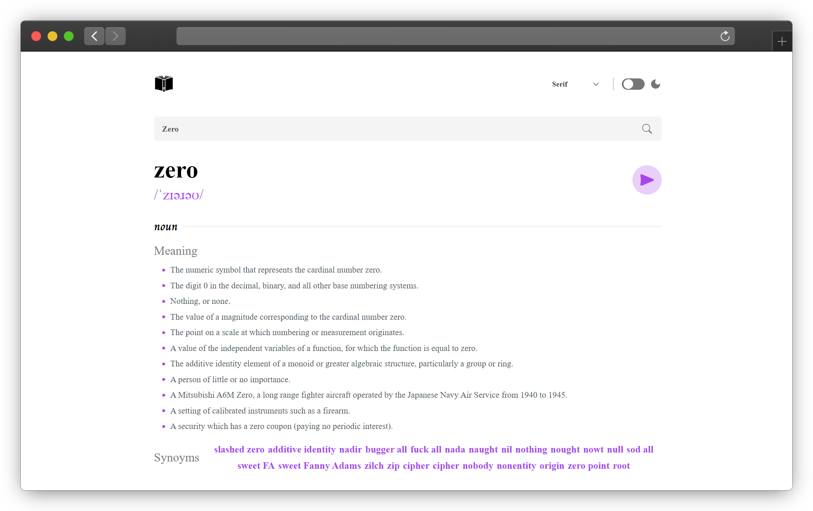

# My Official Website

---

# Description

## Simple Dectionary Web App that let you to search about any English Word with nice Features and Design.

# App Features

- Responsive
- Nice Design with Tailwind Framework
- Speed & Good Performance thanks to [**Remix Framework**](https://remix.run/)
- Sound Feature hat let you to listen to your Search Keyword.

---

# Languages & Technologies

### Languages used in this Web App:

  
  
  

### Technolohies that used in this App:

  

### Other Libs & Packages:

- [**react-icons**](https://react-icons.github.io/react-icons/)
- [**clx**](https://www.npmjs.com/package/clsx)
- [**axios**](https://axios-http.com/docs/intro)
- [**flowbite**](https://flowbite.com/)
- [**flowbite-react**](https://flowbite-react.com/)

---

# Web App Screenshot

